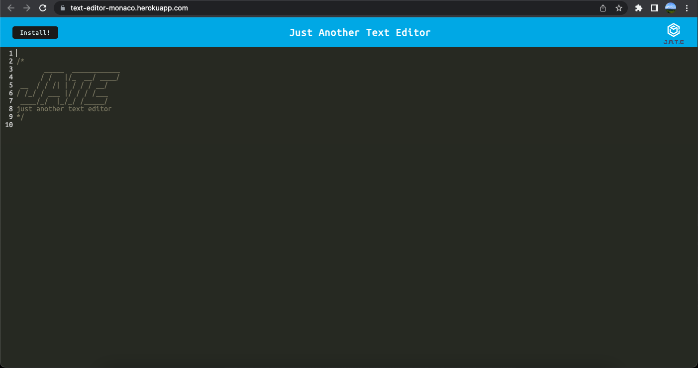

# PWA text-editor: Just Another Text Editor

<details>  
<summary>Table of Contents</summary>

<ol>
<li>
<a href="#about-the-project">About The Project</a></li>
<ul>
<li><a href="#built-with">Built With</a></li>
</ul>
</li>
<li>
<a href="#getting-started">Getting Started</a>
<ul>
<li><a href="#installation">Installation</a>
</ul>
</li>

</ol>

</details>

## About The Project



This is a full-stack application (code snippets) that runs in the browser. This features a number of data persistence techniques that serve as redundancy in case one of the options is not supported by the browser.

[Click Here for the deployed app](https://text-editor-monaco.herokuapp.com/)

<p align = "right">(<a href="#top">back to top</a>)</>

## Built With

- [Express.js](https://expressjs.com/)
- [IndexedDB](https://developer.mozilla.org/en-US/docs/Web/API/IndexedDB_API)
- [if-env](https://www.npmjs.com/package/if-env)
- [babel-loader](https://www.npmjs.com/package/babel-loader)
- [css-loader](https://www.npmjs.com/package/css-loader)
- [style-loader](https://www.npmjs.com/package/style-loader)
- [Webpack](https://webpack.js.org/)
- [code-mirror-themes](https://www.npmjs.com/package/code-mirror-themes)

<p align = "right"> (<a href="#top">back to top</a>)</>

## Getting Started

To get a local copy up and running follow these simple example steps.

## Installation

The application will be invoked by using the following command:

```
git clone https://github.com/monaco-vin/text-editor.git
```

Install npm packages by using the following command:

```
npm i
```

Then,

```
npm start
```

<p align="right">(<a href="#top">back to top</a>)</>
